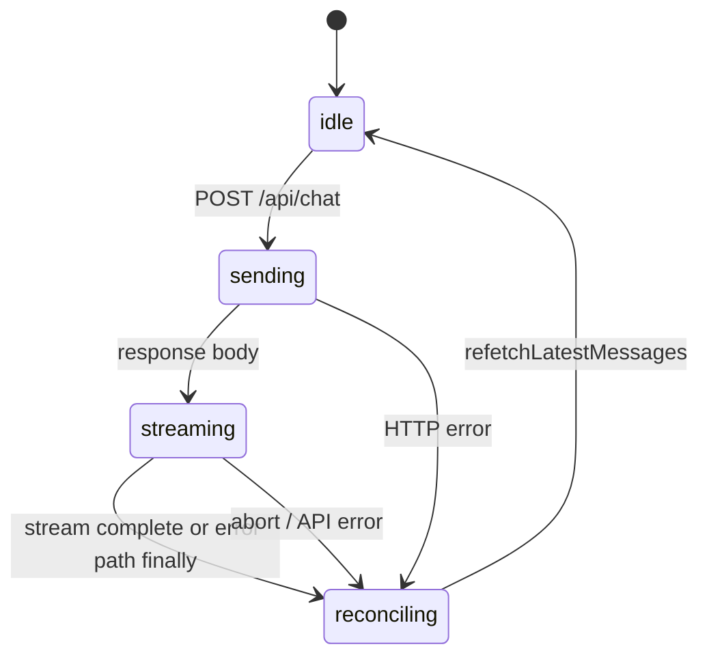

# Chat message UI state machine

Client chat state splits **persisted messages** (from Supabase via RSC + refetch) from **ephemeral UI** (optimistic rows and the live stream buffer).

## States

| Phase | `messages` | `streamingContent` | `isStreaming` |
|-------|------------|--------------------|---------------|
| **idle** | Server IDs only (plus any loaded older pages) | empty | false |
| **sending** | + optional `temp-user-*` (optimistic user bubble) | empty | true |
| **streaming** | same as sending | growing assistant text (not in `messages` yet) | true |
| **reconciling** | temps stripped; `GET …/messages` merges latest page | cleared | false (set before refetch) |

## Dual sources of truth (intentional)

1. **`messages`** — list rendered from DB; during a turn may include `temp-user-*` only (assistant text lives in `streamingContent` until done).
2. **`streamingContent`** — plain-text buffer from `readChatPlainTextStream`; shown as the in-progress assistant bubble in `ChatMessageList`.
3. **Reconcile** — `reconcileWithServer()` drops ephemeral IDs, refetches the latest page, and `mergeWithOlderPrefix` keeps any “load older” prefix.

After a **successful** stream we do not append `temp-assistant-*`; reconcile replaces the tail with server rows (real UUIDs). That avoids duplicate assistant bubbles (temp + stream + server).

Partial **abort** with content may still insert `temp-assistant-*` until reconcile or the user retries.

## Server prop resync

When `chatId` or RSC `initialMessages` / pagination / affection props change (soft navigation or `router.refresh`), hooks reset from props **unless** `isStreaming` — see `useChatStream` resync effects and `lib/chat-server-sync.ts` snapshot keys.

## Ephemeral UI (not persisted)

`myReaction`, `regenerateCount`, and device prefs are client-only. See [docs/CLIENT_EPHEMERAL_STATE.md](../../../../docs/CLIENT_EPHEMERAL_STATE.md).

## Related code

- `useChatMessages.ts` — list, pagination, reconcile
- `useChatSend.ts` — send / regenerate / stream lifecycle
- `useChatRelationship.ts` — `X-*` headers during stream
